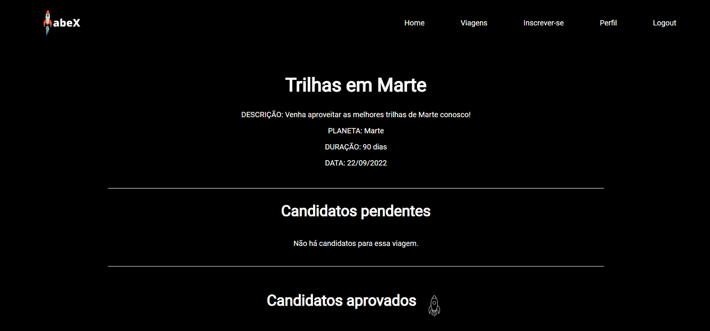
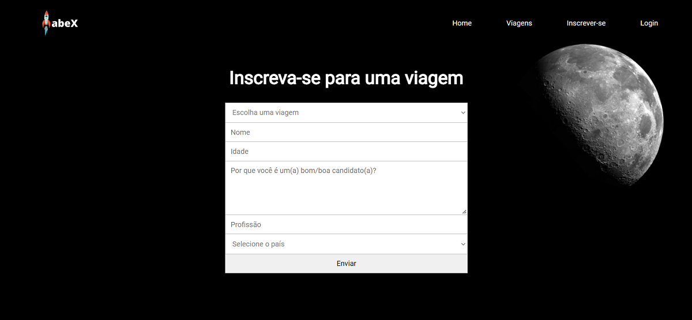
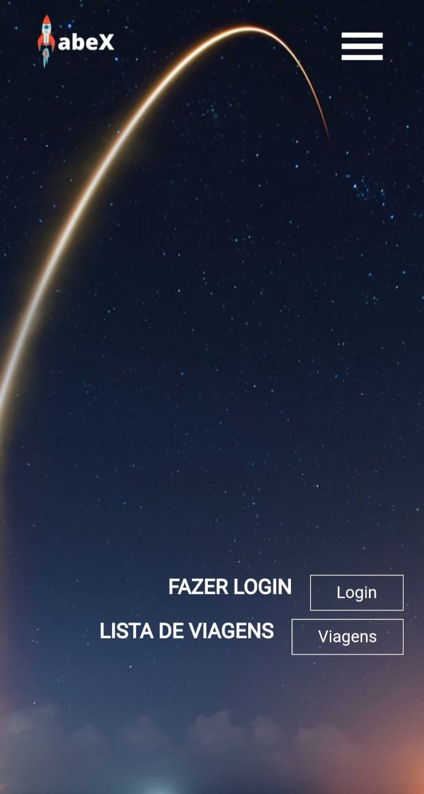
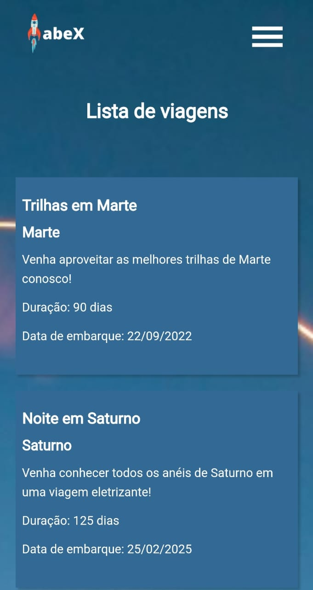
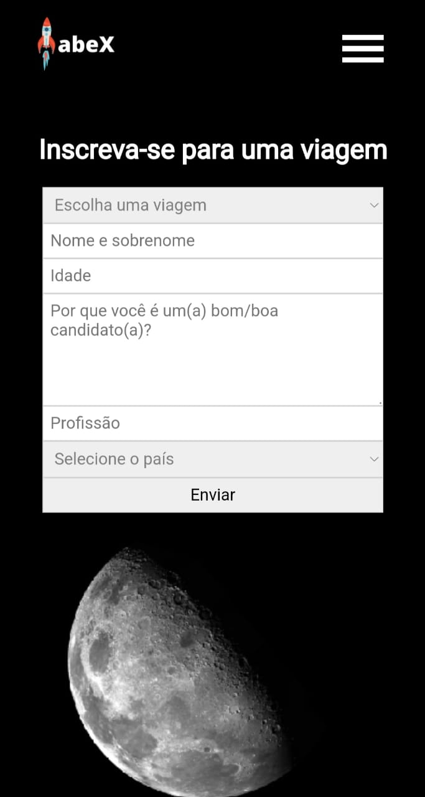
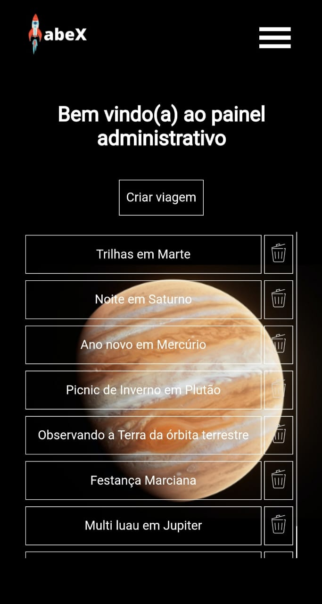
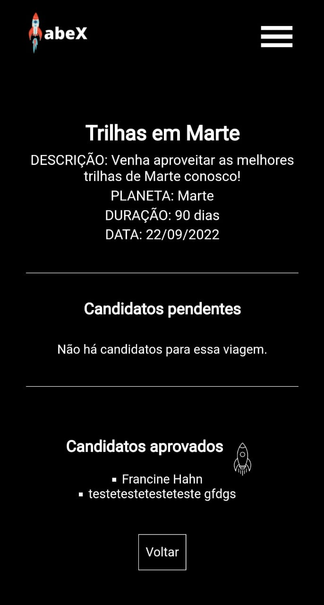
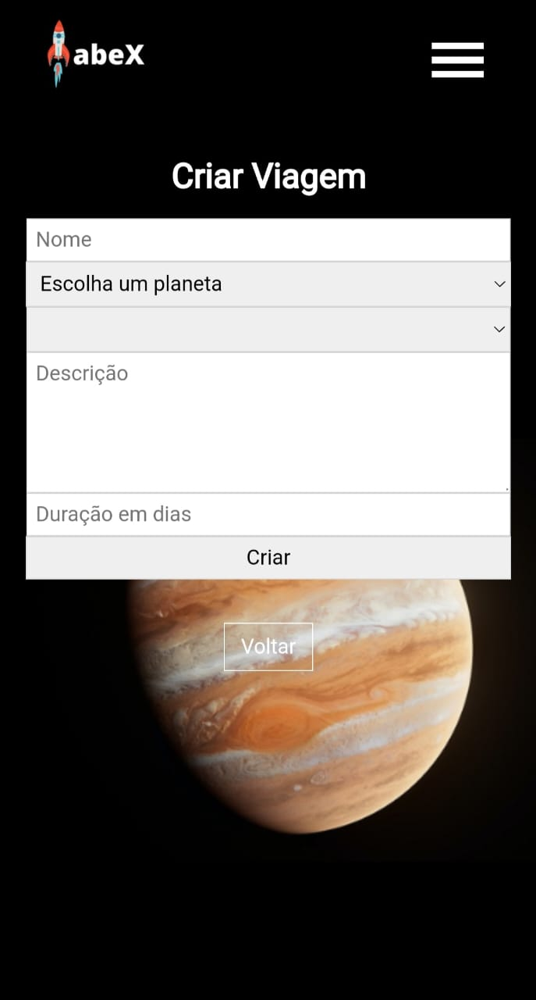
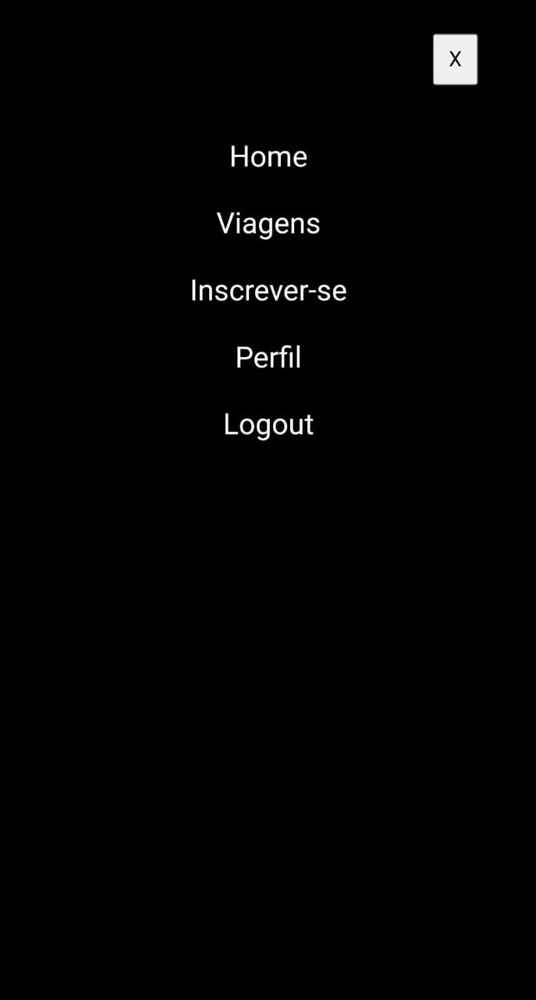

# labeX
This project was developed to practice the consumption of APIs. The API used was developed by Labenu for study purposes.
The website has eight pages and three of them can only be accessed if the user is logged in.
This project is responsive to all screen sizes.

## User and password
User: fran_hahn@hotmail.com
Password: 123456

## Link to acess the project
https://madly-thread.surge.sh/

## Functionalities
* All users can access the available trips and also apply for any of them;
* When the user logs in, they can include new trips to the list and also remove them;
* In addition, the user can also see the trips' details including the list of applicants for each trip;
* When there are applicants for a trip, the user can see the applicant's information and either accept or reject them;
* When the user closes the window, the are automatically logged out.

## Images
### Desktop version

### Mobile version

 

 

 

 

 

 

